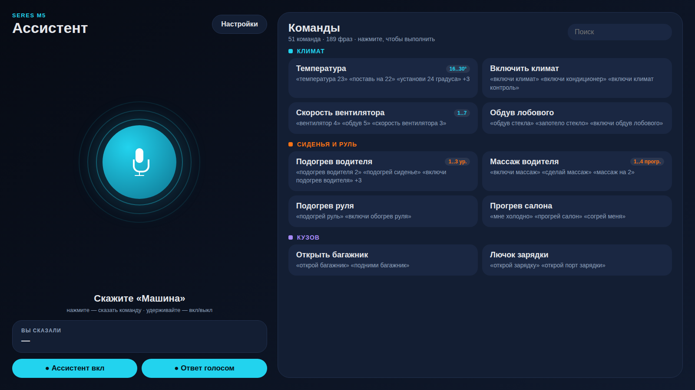
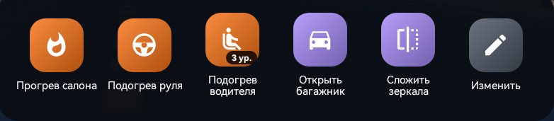

# Seres M5 - голосовой ассистент приборки

Полностью офлайн голосовой ассистент для головного устройства Seres М5.
Устанавливается вместо штатного слота навигации и понимает больше 50 команд
управления климатом, сиденьями, окнами, кузовом и режимами езды - без
интернета, без сторонних серверов.

## Что внутри

- Офлайн-распознавание речи 
- Постоянно слушает ключевое слово в фоне, отвечает голосом
- 51 команда, под каждую - до десятка разных формулировок («как удобно сказать»)
- Карточка «Быстрые действия» на главном экране - любимые команды одним нажатием

## Карточка «Быстрые действия»

Карточка встаёт в нижнюю полосу штатного рабочего стола рядом с заводскими.
Каждая плитка - та же команда, что и голосом: климат, подогрев, окна, багажник
и т.д. Кнопка «Изменить» открывает редактор: добавить команду из каталога,
задать значение (например, температуру или уровень подогрева), поменять порядок,
удалить. Изменения сразу видны на главном экране.

## Установка

APK ставится через флешку:

- [ClusterLauncher.apk](https://github.com/Maxs077/SeresVoice/releases/latest/download/ClusterLauncher.apk) - сам ассистент
- [VoiceKeyBridge.apk](https://github.com/Maxs077/SeresVoice/releases/latest/download/VoiceKeyBridge.apk) - мост для кнопки голоса на руле, ставится один раз

После установки открой ассистент
При первом запуске скажет, что нужно для голоса (микрофон и т.п.).

## Голос

Ключевое слово по умолчанию - **«машина»**. Меняется в настройках приложения
(шестерёнка) на любое обычное русское слово.

Схема: **‹ключевое слово› + команда** одной фразой, либо ключевое слово -
затем команда следующей фразой (окно ожидания ~7 секунд).

Пример: *«машина, включи климат»* или *«машина»* → (жду) → *«включи подогрев
руля»*.

## Все команды

### Климат
| Команда | Примеры фраз |
|---|---|
| Температура (число) | «температура 23», «поставь на 22», «установи 24 градуса» |
| Теплее / холоднее | «теплее», «мне жарко», «прибавь температуру» |
| Климат вкл/выкл | «включи климат», «включи кондиционер», «выключи климат» |
| Авто-режим | «климат авто», «включи автоматический режим» |
| Вентилятор (число) | «вентилятор 4», «скорость вентилятора 3», «обдув 5» |
| Обдув сильнее/слабее | «сильнее дуй», «прибавь обдув», «слабее дуй» |
| Рециркуляция вкл/выкл | «включи рециркуляцию», «закрой воздух», «свежий воздух» |
| Обдув лобового вкл/выкл | «обдув стекла», «запотело стекло», «выключи обдув стекла» |
| Обогрев заднего стекла | «обогрев заднего стекла», «подогрей заднее стекло» |

### Сиденья и руль
| Команда | Примеры фраз |
|---|---|
| Подогрев водителя/пассажира (уровень 1-3) | «подогрев водителя 2», «подогрей сиденье», «включи подогрев пассажира» |
| Подогрев передних/задних | «подогрев передних сидений», «подогрей задние сиденья» |
| Подогрев выкл | «выключи подогрев» |
| Вентиляция сидений | «вентиляция сиденья», «охлади сиденье», «выключи вентиляцию» |
| Подогрев руля вкл/выкл | «подогрей руль», «включи обогрев руля» |
| Прогрев салона (климат+сиденья+руль одной фразой) | «мне холодно», «прогрей салон», «согрей меня» |
| Массаж водителя/пассажира (программа 1-4) | «включи массаж», «сделай массаж», «массаж пассажира» |
| Сила массажа (1-3) | «сила массажа 2», «массаж на силу 3» |

### Кузов
| Команда | Примеры фраз |
|---|---|
| Багажник открыть/закрыть/стоп | «открой багажник», «закрой багажник», «стоп багажник» |
| Лючок бензобака | «открой бензобак», «открой лючок топлива» |
| Порт зарядки | «открой зарядку», «открой порт зарядки» |
| Зеркала сложить/разложить | «сложи зеркала», «разложи зеркала» |

### Окна
| Команда | Примеры фраз |
|---|---|
| Все окна открыть/закрыть | «открой окна», «опусти стекла», «закрой все окна» |
| Проветрить (щель) | «проветри», «приоткрой окна» |
| Окно водителя/пассажира | «открой моё окно», «закрой окно пассажира» |
| Задние окна | «открой задние окна», «закрой задние окна» |

### Режимы и свет
| Команда | Примеры фраз |
|---|---|
| Режим езды спорт/комфорт/эко | «режим спорт», «комфортный режим», «включи эко» |
| Атмосферная подсветка вкл/выкл | «включи подсветку», «выключи подсветку салона» |

## ⬇️ Скачать

- **[ClusterLauncher.apk](https://github.com/Maxs077/SeresVoice/releases/latest/download/ClusterLauncher.apk)** - ассистент
- **[VoiceKeyBridge.apk](https://github.com/Maxs077/SeresVoice/releases/latest/download/VoiceKeyBridge.apk)** - мост для кнопки голоса на руле

Все версии: [Releases](https://github.com/Maxs077/SeresVoice/releases)
